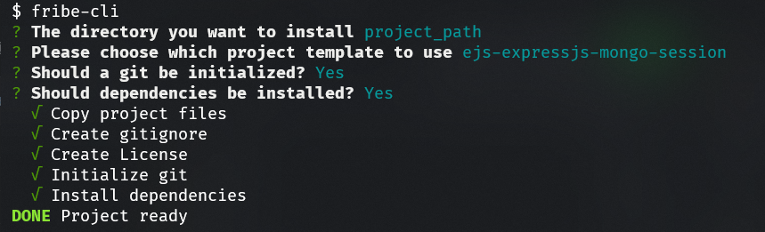

# `@fribe/fribe-cli`

##  Project base builder for everyone



## Installation & Usage

```bash
npm init @fribe/fribe-cli
# or
npx @fribe/fribe-cli
# or
npm install -g @fribe/fribe-cli
# or
npm install -g @fribe/fribe-cli

fribe-cli
```

## License

MIT

## Collaborators

- Ömer Faruk Biçer <omerfarukbicer0446@gmail.com>
